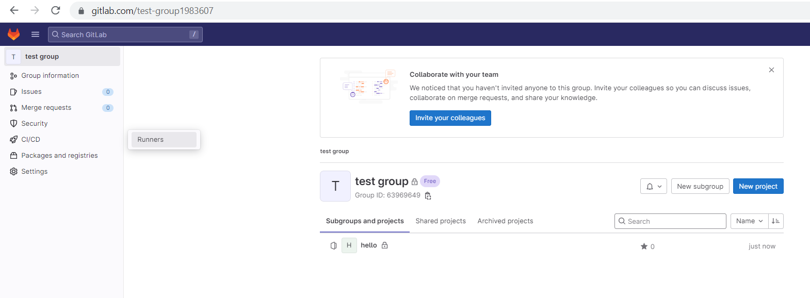
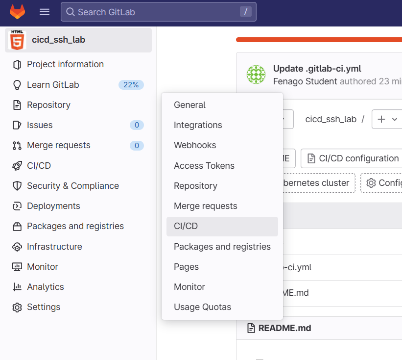
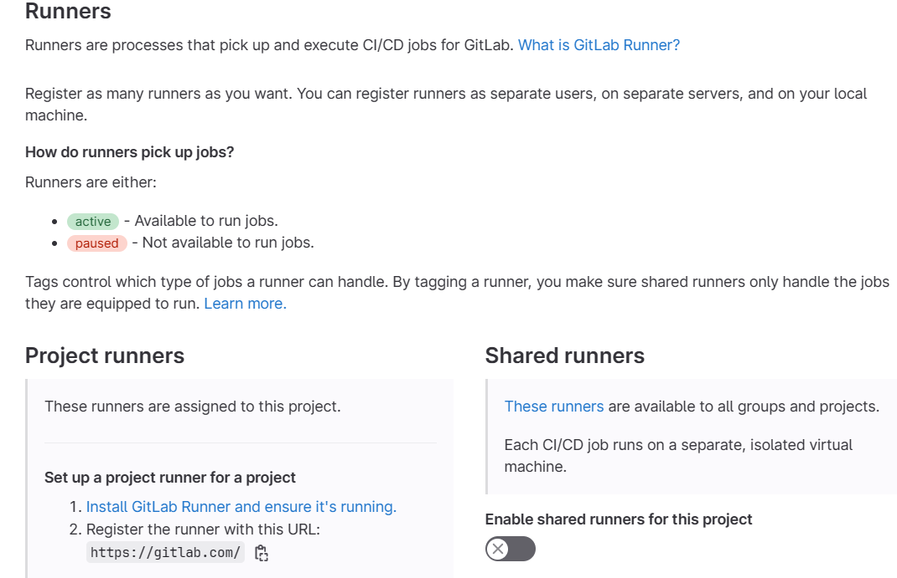
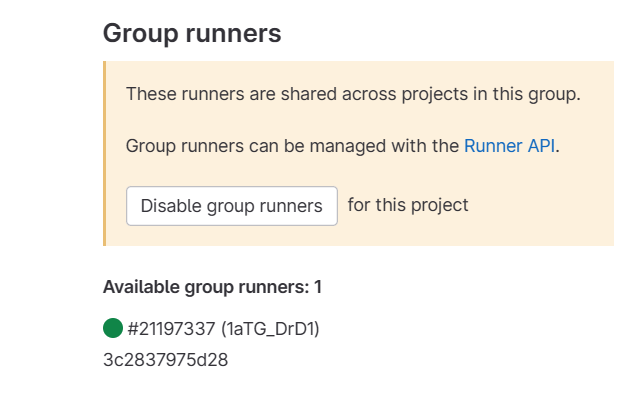

### Lab: Run GitLab Runner in a container

We can run github runners locally. In this lab, we will register gitlab-runner on `gitlab.com`.


**NOTE:** Make sure to open new terminal and connect with your remote VM before running docker commands below:

`ssh ubuntu@YOUR_VM_DNS_NAME.courseware.io`

**Password:** Will be provided by Instructor.


In this lab, you can use a configuration container to mount your custom data volume.

Create the Docker volume:

```
docker volume create gitlab-runner-config
```

Start the GitLab Runner container using the volume we just created:

```
docker run -d --name gitlab-runner --restart always \
    -v /var/run/docker.sock:/var/run/docker.sock \
    -v gitlab-runner-config:/etc/gitlab-runner \
    gitlab/gitlab-runner:latest
```


#### Group Runner Setup

1. On the top bar, select `Main menu` > `Groups` and find your group.


  **Note:** If you don't have one, click `New Group` to create new one.

2. On the left sidebar, select `CI/CD` > `Runners`.


3. In the upper-right corner, select `Register a group runner` and copy **Registration token** from the next steps .


### Register a Runner

1. To register a runner using a Docker container:

```
docker run --rm -it -v gitlab-runner-config:/etc/gitlab-runner gitlab/gitlab-runner:latest register
```

2. Enter your GitLab instance URL (also known as the gitlab-ci coordinator URL):
    `https://gitlab.com/`

3. Enter the token you obtained to register the runner.
4. Enter a description for the runner. You can change this value later in the GitLab user interface.
5. Enter the tags associated with the runner, separated by commas. You can change this value later in the GitLab user interface.
6. Enter any optional maintenance note for the runner.
7. Provide the runner executor: enter **docker**.
8. If you entered docker as your executor, you are asked for the default image to be used for projects that do not define one in .gitlab-ci.yml: enter **ruby:2.7**


9. Reload the webpage, you should see one runner available.


### Using Gitlab Runner in CI/CD

1. **Important!** Make sure to create new project inside the group so that you can use the runner:


2. Disable shared runners for all the projects that you create. Otherwise, gitlab will fail your pipeline and ask for account verification.

3. On the left sidebar, select `Settings` > `CI/CD`.


4. Expand `Runners` and disable shared runners for this project.


5. Scroll to `Group runners` and confirm one runner is available.



**Important!** You will need to disable shared runner for all gitlab projects.