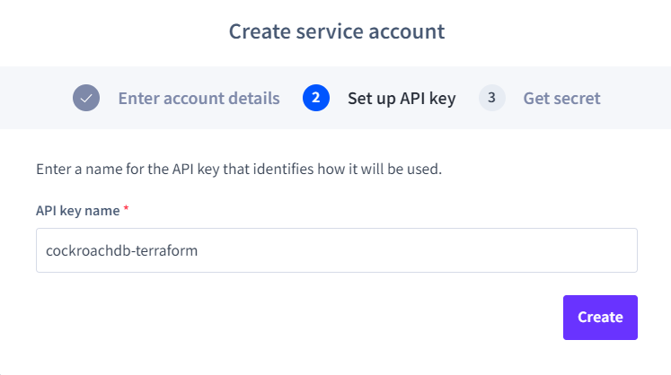
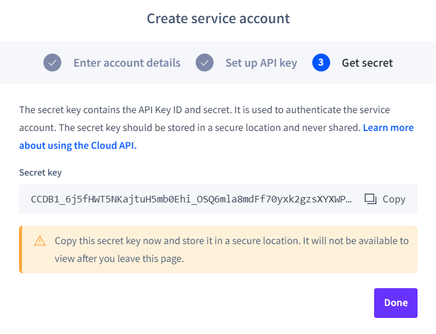
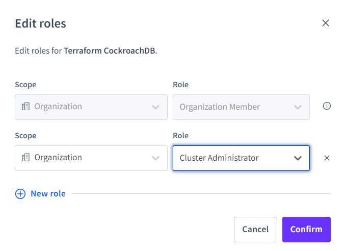

# Lab 14: Initial Deployment of CockroachDB with Terraform


Terraform is an infrastructure-as-code
provisioning tool that uses configuration files to define application
and network resources. You can provision CockroachDB Cloud clusters and
cluster resources by using the [CockroachDB Cloud Terraform
provider](https://registry.terraform.io/providers/cockroachdb/cockroach)
in your Terraform configuration files.

This lab shows you how to provision a CockroachDB Cloud cluster
using the CockroachDB Cloud Terraform provider.


**CockroachDB Serverless**


## Before you begin

Before you start this lab, you must

1. Install Terraform.
2. Create a Free CockroachDB Account: https://www.cockroachlabs.com/


##  Create a service account

1. On the Access Management page, select the Service Accounts tab.

    

2. Click Create.

3. Enter a **Account name** and **Description**.
    

4. Create and export an **API** key.
    

    

5. Confirm creation of the service account.

##  Edit roles on a service account

1. On the Access Management page, select the Service Accounts tab.

2. In the row for the target service account, click, click the three-dots **Action** button and select **Edit Roles**.

    

3. Add the new role Cluster Administrator and click `Confirm`.

    

A number of fine-grained roles can be assigned to a given service account. These are the same roles that can be assigned to users. Each role is represented by a row. Each row has a scope, which is either Organization or the name of a particular cluster. If the role is Cluster Administrator, Cluster Operator, or Cluster Developer, assigning it at the organization scope means that it applies to all clusters in the organization.


## Create the Terraform configuration files

Terraform uses a infrastructure-as-code approach to managing resources.
Terraform configuration files allow you to define resources
declaratively and let Terraform manage their lifecycle.


In this lab, you will create a CockroachDB Serverless cluster.

1.  In a terminal create a new directory and use `wget` to download the
    CockroachDB Serverless `main.tf` example file:

    
    ```
    wget https://raw.githubusercontent.com/cockroachdb/terraform-provider-cockroach/main/examples/workflows/cockroach_serverless_cluster/main.tf
    ```
    

2.  In a text editor create a new file `terraform.tfvars` with the
    following settings:

    
    ```
    cluster_name = "{cluster name}"
    sql_user_name = "{SQL user name}"
    sql_user_password = "{SQL user password}"
    ```
    

    Where:

    -   `{cluster name}` is the name of the cluster you want to create.
    -   `{SQL user name}` is the name of the SQL user you want to
        create.
    -   `{SQL user password}` is the password for the SQL user you want
        to create.

    For example, the following `terraform.tfvars` file creates a
    CockroachDB Serverless with a `maxroach` SQL user.

    
    ```
    cluster_name = "blue-dog"
    sql_user_name = "maxroach"
    sql_user_password = "Fenago@12345"
    ```
    

3.  Create an environment variable named `COCKROACH_API_KEY`. Copy the `API key`
    from the CockroachDB Cloud console and create the
    `COCKROACH_API_KEY` environment variable:

    
    ```
    export COCKROACH_API_KEY={API key}
    ```
    

    Where `{API key}` is the API key you copied from the CockroachDB Cloud Console.


## Provision the cluster

1.  Initialize the provider:

    
    ```
    terraform init -upgrade
    ```
    

    This reads the `main.tf` configuration file and uses the
    `terraform.tfvars` file for settings specific to your cluster. The
    `-upgrade` flag ensures you are using the latest version of the
    provider.

2.  Create the Terraform plan. This shows the actions the provider will
    take, but won\'t perform them:

    
    ```
    terraform plan
    ```
    

3.  Create the cluster:

    
    ```
    terraform apply
    ```
    

    Enter `yes` when prompted to apply the plan and create the cluster.

You will see output similar to the following:

```
Terraform used the selected providers to generate the following execution
plan. Resource actions are indicated with the following symbols:
+ create

Terraform will perform the following actions:

# cockroach_cluster.example will be created
+ resource "cockroach_cluster" "example" {
    + account_id        = (known after apply)
    + cloud_provider    = "GCP"
    + cockroach_version = (known after apply)
    + creator_id        = (known after apply)
    + id                = (known after apply)
    + name              = "blue-dog"
    + operation_status  = (known after apply)
    + plan              = (known after apply)
    + regions           = [
        + {
            + name       = "us-central1"
            + node_count = (known after apply)
            + sql_dns    = (known after apply)
            + ui_dns     = (known after apply)
            },
        ]
    + serverless        = {
        + routing_id  = (known after apply)
        + spend_limit = 0
        }
    + state             = (known after apply)
    }

# cockroach_sql_user.example will be created
+ resource "cockroach_sql_user" "example" {
    + cluster_id = (known after apply)
    + id         = (known after apply)
    + name       = "maxroach"
    + password   = (sensitive value)
    }

Plan: 2 to add, 0 to change, 0 to destroy.

Do you want to perform these actions?
Terraform will perform the actions described above.
Only 'yes' will be accepted to approve.

Enter a value: yes

cockroach_cluster.example: Creating...
cockroach_cluster.example: Creation complete after 5s [id=1aaae1f8-19e2-4653-ba62-db16de2a84b9]
cockroach_sql_user.example: Creating...
cockroach_sql_user.example: Creation complete after 2s [id=1aaae1f8-19e2-4653-ba62-db16de2a84b9:maxroach]

Apply complete! Resources: 2 added, 0 changed, 0 destroyed.
```

## Get information about your cluster

The `terraform show` command shows detailed information of your cluster
resources.


```
terraform show
```


This will show the following output:


```
# cockroach_cluster.example:
resource "cockroach_cluster" "example" {
    cloud_provider    = "GCP"
    cockroach_version = "v22.1"
    creator_id        = "98e75f0a-072b-44dc-95d2-cc36cd425cab"
    id                = "1aaae1f8-19e2-4653-ba62-db16de2a84b9"
    name              = "blue-dog"
    operation_status  = "CLUSTER_STATUS_UNSPECIFIED"
    plan              = "SERVERLESS"
    regions           = [
        # (1 unchanged element hidden)
    ]
    serverless        = {
        routing_id  = "blue-dog-6821"
        spend_limit = 0
    }
    state             = "CREATED"
}

# cockroach_sql_user.example:
resource "cockroach_sql_user" "example" {
    cluster_id = "1aaae1f8-19e2-4653-ba62-db16de2a84b9"
    id         = "1aaae1f8-19e2-4653-ba62-db16de2a84b9:maxroach"
    name       = "maxroach"
    password   = (sensitive value)
}
```


Go to CockroachDB Console and confirm cluster has been created. Also, `COCKROACH_API_KEY` will be required in Lab 15 as well.